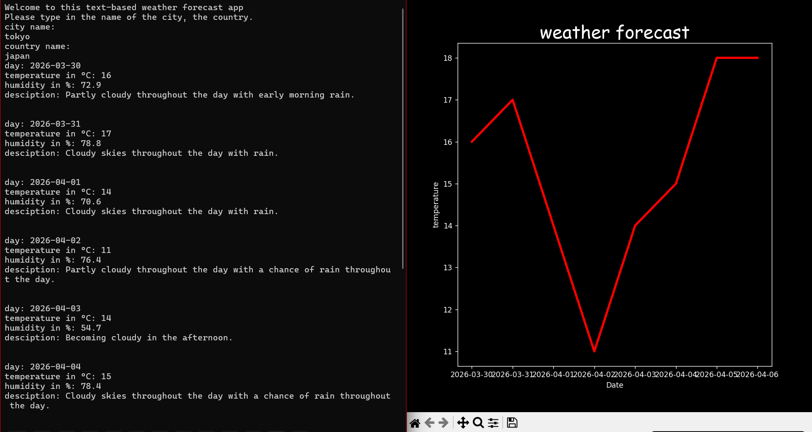

# Description
A simple app to show a weather forecast for a city over 7 days. It uses an API from `https://www.visualcrossing.com/` to fetch the real life data and visualize it. 

## Usage
* run the "main.py" file inside the folder with `py -m main.py`

## Libaries used
* requests
* pathlib
* datetime
* numpy
* matplotlib

## How to use
When started to run, the app will ask the user for the city and the country they want to get the forecast. After submitting, it will give brief informations for every day and automatically visualize the data.
 

## Roadmap
* v1: first version, developing the core function
* v2: exclude the API-key, remove hardcoded filepath 
* v3: adding a graphical interface for better usability